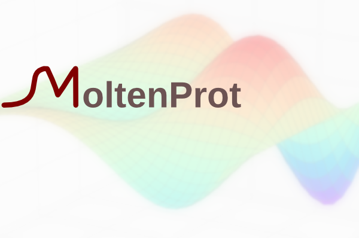

# MoltenProt

MoltenProt is a graphical and command-line application for fitting protein thermal unfolding data. For more details see the publication:

**In-depth interrogation of protein thermal unfolding data with MoltenProt**

[https://doi.org/10.1002/pro.3986](https://doi.org/10.1002/pro.3986)

## Installation

### Pre-packaged binaries

See [Releases](https://github.com/kvr2007/moltenprot/releases) to get ready-to-use executables for Windows and Mac.

Older versions of MoltenProt are also available here:

http://marlovitslab.org/lab/Download.html

### From source code

If you have python (versions 3.8 and above) available on your system, you can install MoltenProt as follows: 

1. (OPTIONAL) create a virtual environment:
    
    `python -m venv venv`
    
2. (OPTIONAL) activate the virtual environment:

    a. Windows:
    
    `venv\Scripts\activate`
        
    b. GNU/Linux and Mac:
    
    `source venv/bin/activate`

3. Install the MoltenProt package from this repo:
    
    `python -m pip install --use-pep517 moltenprot[gui,multiproc]@git+https://github.com/kvr2007/moltenprot.git@master`

    (this will install with GUI and multiprocessing capability)
    
    alternatively, download a WHL file from [releases](https://github.com/kvr2007/moltenprot/releases) and run:
    
    `python -m pip install moltenprot-0.4.1b0-py3-none-any.whl`
    
    (the actual file name may differ depending on the version)

You can now launch the GUI with command `moltenprot_gui` or access the CLI with `moltenprot`.

For additional documentation see [INSTALL](INSTALL.md).

[CHANGELOG](CHANGELOG.md)

To test the installation run:

`python -m moltenprot.test`

## Usage

User guide is available in [PDF format](moltenprot/doc/index.pdf) and also from the GUI "Help > MoltenProt help".

## Survey

If you regularly use MoltenProt, please consider filling out the usage survey:

[MoltenProt Survey](https://forms.gle/EacRgkQXfad4JnZx7)

No sensitive data is collected in the survey, and it will help prioritize future developments.

## Getting help

Please open an issue [here](https://github.com/kvr2007/moltenprot/issues).
